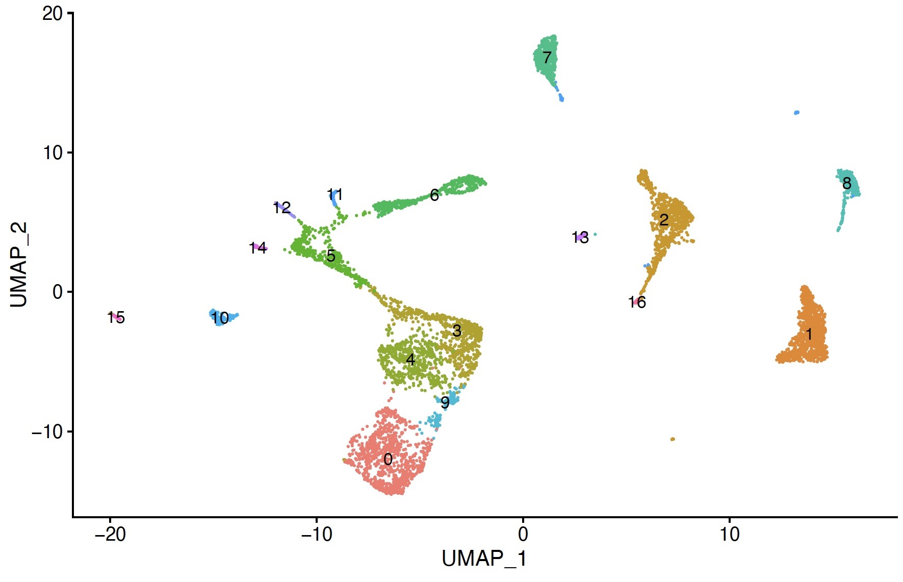
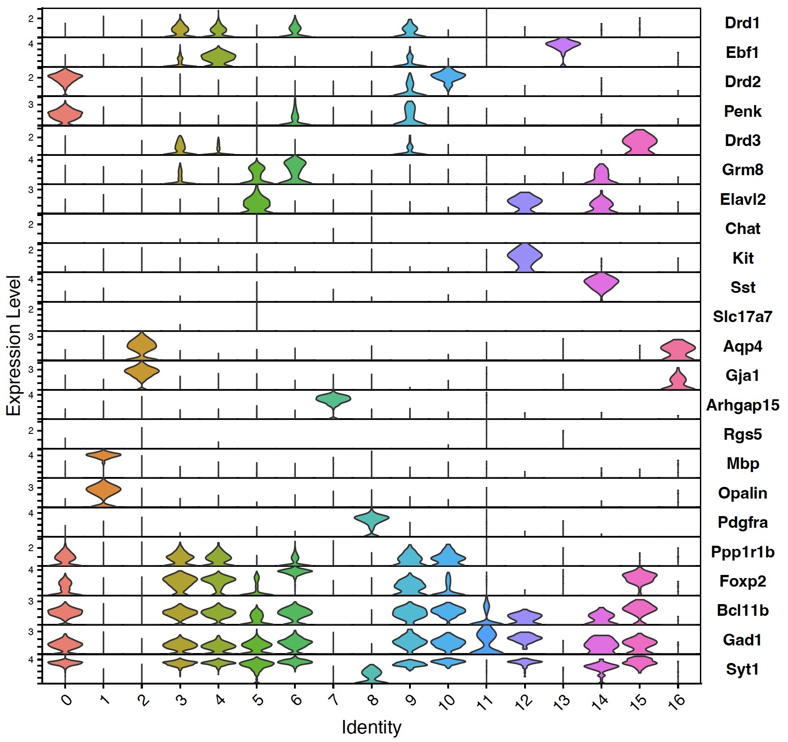
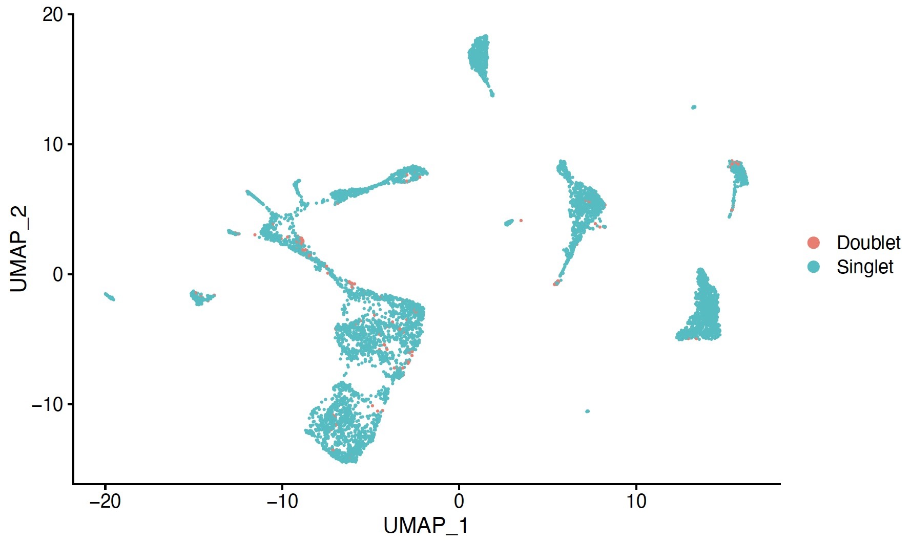
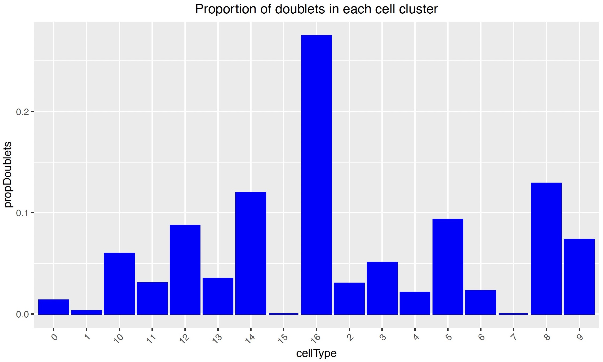
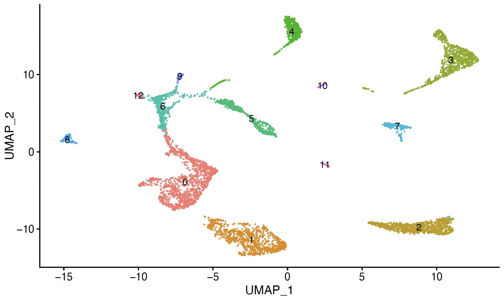
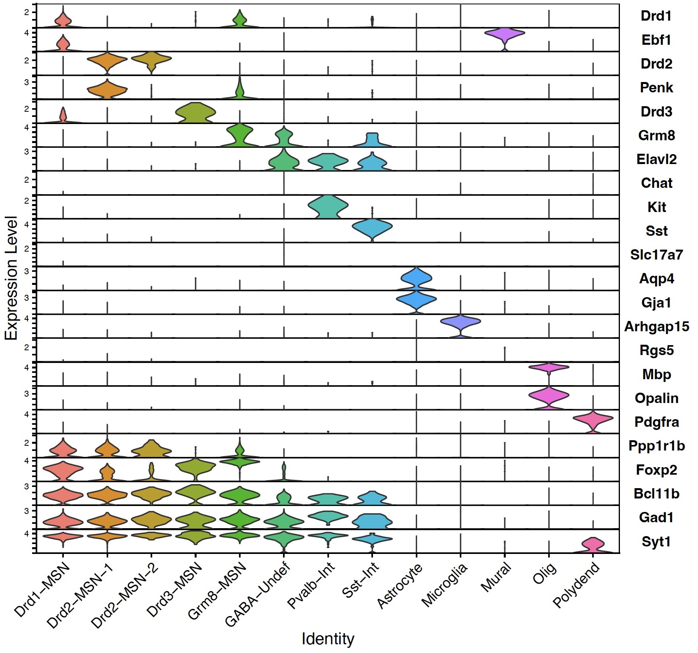

# snRNA-Seq Analysis: Data Processing

This tutorial covers quality control and processing of counts output from CellRanger to prepare an integrated Seurat object for differential gene expression (DEG) analysis.

First, let's load all the packages we will be using.

```
library(Seurat)
library(SoupX)
library(scCustomize)
library(patchwork)
library(dplyr)
library(ggplot2)
library(cowplot)
library(DoubletFinder)

```

## Study design
We have 8 datasets, each composed of cells (nuclei) from a single rat:

| Sample | Sex | Treatment | R Obj |
| :---: | :----: | :---: | :---: |
| S1 | male | lacZ | male1.lacz |
| S2 | male | Reln | male1.reln |
| S3 | female | lacZ | fem1.lacz |
| S4 | female | Reln | fem1.reln |
| S5 | female | lacZ | fem2.lacz |
| S6 | female | Reln | fem2.reln |
| S7 | male | Reln | male2.reln |
| S8 | male | lacZ | male2.lacz |

The quality-control (QC) steps we will go through below are performed separately on each dataset, and then we will integrate the filtered datasets.

For simplicity, I'll only show one dataset (S1, male1.lacz) here until we get to the integration step, but the R script has the full analysis code.

## 1. QC: Remove ambient RNA
The first QC step is to filter out cell-free ambient RNA using **SoupX**.

First, read in the data. The CellRanger output needed for SoupX are the following directories (and their contents), which I put in a folder named `outs`: `raw_feature_bc_matrix`, `filtered_feature_bc_matrix`, and `analysis` (contains the clustering info SoupX will use).

```
male1.lacz.data <- load10X("../cellranger/completed/1_lacZ_S1_M1/outs")
```

```
## Loading raw count data
## Loading cell-only count data
## Loading extra analysis data where available
```

Now we run SoupX functions to (1) estimate the ambient RNA contamination and (2) infer a corrected (cleaned) expression matrix after removing ambient RNA.

In the second step (`adjustCounts()`), note that we need to specify `rountToInt = TRUE` because downstream analysis with DESeq2 requires integers.

```
# Estimate ambient mRNA contamination
male1.lacz.data <- autoEstCont(male1.lacz.data)
```

```
## 127 genes passed tf-idf cut-off and 44 soup quantile filter.  Taking the top 44.
## Using 134 independent estimates of rho.
## Estimated global rho of 0.01

```

If you look in the details above, you see noted that one sample (fem1.reln.data) failed, probably because of the low number of cells. So we'll omit that sample from the rest of the SoupX steps and manually import it later.

```
# Infer corrected expression matrix
male1.lacz.clean <- adjustCounts(male1.lacz.data, roundToInt = TRUE)
```

```
## Expanding counts from 5 clusters to 635 cells.
## Warning message:
## In sparseMatrix(i = out@i[w] + 1, j = out@j[w] + 1, x = out@x[w],  :
##   'giveCsparse' is deprecated; setting repr="T" for you
```

Lastly, we take the cleaned expression matrices and create a **Seurat object** for each sample. At this point, we will set arbitrary cutoffs for minimum number of cells with a gene to keep that gene and minimum number of genes in a cell to keep that cell (both set to 1). We will do more stringent QC filtering later.

```
male1.lacz <- CreateSeuratObject(male1.lacz.clean, min.cells = 1, min.features = 1)
```

```
## Warning: Feature names cannot have underscores ('_'), replacing with dashes ('-')
```

The warning above just tells you that any genes that have dashes (-) in the name are renamed with underscores (_).

Here's where we will import the sample that failed SoupX and directly create a Seurat object, bypassing SoupX:

```
# Seurat function Read10X() instead of SoupX function load10X()
fem1.reln.data <- Read10X("../cellranger/completed/4_Reln_S4_F1/outs/filtered_feature_bc_matrix")

# Create Seurat obj
fem1.reln <- CreateSeuratObject(fem1.reln.data, min.cells = 1, min.features = 1)
```

## 2. QC: Remove cells with few genes & high mtDNA
Some mitochondrial genes in the Rn7 reference genome have the prefix "Mt-" (such as Mt-nd1), but others don't (such as AY172581.x). But all mitochondrial genes are listed as located on chromosome "MT". So to make a list of all mitochondrial genes, we import the GTF file (chromosome name is imported as "seqnames") and search for all genes with seqname "MT".

```
# Import GTF file
Rn7_gtf <- as.data.frame(rtracklayer::import("../custom_reference/Rattus_norvegicus.mRatBN7.2.109_Chimera.gtf"))

# Create vector directly from reference to contain all mt genes
MT_genes <- subset(Rn7_gtf,subset = (seqnames == "MT" & type == "gene"))$gene_name
```

Now we create a new column in the sample metadata (`percent.mt`) to store the percent of genes in that sample that mapped to mitochondrial genes:

```
male1.lacz <- PercentageFeatureSet(male1.lacz,
                                   features = MT_genes[which(MT_genes %in% rownames(male1.lacz@assays$RNA@counts))],
                                   col.name = "percent.mt")
```

Now we do the filtering: keep cells that have more than 200 genes AND less than 5% mitochondrial genes:

```
male1.lacz <- subset(male1.lacz, subset = nFeature_RNA > 200 & percent.mt < 5)
```

## 3. Add metadata
Here, we add some metadata that we will need later: for each sample, the target, sex, sex_target, and GEM well.

```
male1.lacz$target <- "lacz"
male1.lacz$sex <- "male"
male1.lacz$sex_target <- "male_lacz"
male1.lacz$GEM <- 1
```

## 4. Normalize data & ID variable genes
For each dataset independently, we normalize and log-transform the data (the function `NormalizeData()` does both) and then identify the 3,000 genes that show highest cell-to-cell variability in expression.

```
# Normalize data under default parameters
male1.lacz <- NormalizeData(male1.lacz)
```

```
## Performing log-normalization
## 0%   10   20   30   40   50   60   70   80   90   100%
## [----|----|----|----|----|----|----|----|----|----|
## **************************************************|
```

```
# ID features that show high cell-to-cell variation in expression
male1.lacz <- FindVariableFeatures(male1.lacz, selection.method = "vst", nfeatures = 3000)
```

```
## Calculating gene variances
## 0%   10   20   30   40   50   60   70   80   90   100%
## [----|----|----|----|----|----|----|----|----|----|
## **************************************************|
## Calculating feature variances of standardized and clipped values
## 0%   10   20   30   40   50   60   70   80   90   100%
## [----|----|----|----|----|----|----|----|----|----|
## **************************************************|
```

At this point, save all of the individual datasets as R objects:

```
saveRDS(male1.lacz, "male1.lacz.rds")
```

## 5. Integrate datasets

To integrate the 8 datasets, we first identify "anchor" pairs of cells between samples that share patterns of gene expression. We specify to use the first 17 dimensions in the neighbor search.

```
anchors.allRats <- FindIntegrationAnchors(object.list = list(male1.lacz,
                                                             male1.reln,
                                                             fem1.lacz,
                                                             fem1.reln,
                                                             fem2.lacz,
                                                             fem2.reln,
                                                             male2.reln,
                                                             male2.lacz),
                                          dims = 1:17)
```

<details><summary>Output</summary>

```
## Computing 2000 integration features
## Scaling features for provided objects
##   |++++++++++++++++++++++++++++++++++++++++++++++++++| 100% elapsed=00s  
## Finding all pairwise anchors
##   |                                                  | 0 % ~calculating  Running CCA
## Merging objects
## Finding neighborhoods
## Finding anchors
## 	Found 1797 anchors
## Filtering anchors
## 	Retained 1779 anchors
##   |++                                                | 4 % ~01m 01s      Running CCA
## Merging objects
## Finding neighborhoods
## Finding anchors
## 	Found 1677 anchors
## Filtering anchors
## 	Retained 1667 anchors
##   |++++                                              | 7 % ~56s          Running CCA
## Merging objects
## Finding neighborhoods
## Finding anchors
## 	Found 1657 anchors
## Filtering anchors
## 	Retained 1644 anchors
##   |++++++                                            | 11% ~53s          Running CCA
## Merging objects
## Finding neighborhoods
## Finding anchors
## 	Found 1710 anchors
## Filtering anchors
## 	Retained 1691 anchors
##   |++++++++                                          | 14% ~50s          Running CCA
## Merging objects
## Finding neighborhoods
## Finding anchors
## 	Found 1582 anchors
## Filtering anchors
## 	Retained 1565 anchors
##   |+++++++++                                         | 18% ~47s          Running CCA
## Merging objects
## Finding neighborhoods
## Finding anchors
## 	Found 1523 anchors
## Filtering anchors
## 	Retained 1511 anchors
##   |+++++++++++                                       | 21% ~44s          Running CCA
## Merging objects
## Finding neighborhoods
## Finding anchors
## 	Found 2123 anchors
## Filtering anchors
## 	Retained 2088 anchors
##   |+++++++++++++                                     | 25% ~44s          Running CCA
## Merging objects
## Finding neighborhoods
## Finding anchors
## 	Found 2106 anchors
## Filtering anchors
## 	Retained 2080 anchors
##   |+++++++++++++++                                   | 29% ~44s          Running CCA
## Merging objects
## Finding neighborhoods
## Finding anchors
## 	Found 1957 anchors
## Filtering anchors
## 	Retained 1946 anchors
##   |+++++++++++++++++                                 | 32% ~43s          Running CCA
## Merging objects
## Finding neighborhoods
## Finding anchors
## 	Found 1830 anchors
## Filtering anchors
## 	Retained 1798 anchors
##   |++++++++++++++++++                                | 36% ~41s          Running CCA
## Merging objects
## Finding neighborhoods
## Finding anchors
## 	Found 2334 anchors
## Filtering anchors
## 	Retained 2172 anchors
##   |++++++++++++++++++++                              | 39% ~41s          Running CCA
## Merging objects
## Finding neighborhoods
## Finding anchors
## 	Found 2306 anchors
## Filtering anchors
## 	Retained 2236 anchors
##   |++++++++++++++++++++++                            | 43% ~40s          Running CCA
## Merging objects
## Finding neighborhoods
## Finding anchors
## 	Found 2073 anchors
## Filtering anchors
## 	Retained 2000 anchors
##   |++++++++++++++++++++++++                          | 46% ~39s          Running CCA
## Merging objects
## Finding neighborhoods
## Finding anchors
## 	Found 1998 anchors
## Filtering anchors
## 	Retained 1895 anchors
##   |+++++++++++++++++++++++++                         | 50% ~37s          Running CCA
## Merging objects
## Finding neighborhoods
## Finding anchors
## 	Found 2758 anchors
## Filtering anchors
## 	Retained 2622 anchors
##   |+++++++++++++++++++++++++++                       | 54% ~37s          Running CCA
## Merging objects
## Finding neighborhoods
## Finding anchors
## 	Found 1655 anchors
## Filtering anchors
## 	Retained 1622 anchors
##   |+++++++++++++++++++++++++++++                     | 57% ~33s          Running CCA
## Merging objects
## Finding neighborhoods
## Finding anchors
## 	Found 1749 anchors
## Filtering anchors
## 	Retained 1742 anchors
##   |+++++++++++++++++++++++++++++++                   | 61% ~30s          Running CCA
## Merging objects
## Finding neighborhoods
## Finding anchors
## 	Found 1524 anchors
## Filtering anchors
## 	Retained 1514 anchors
##   |+++++++++++++++++++++++++++++++++                 | 64% ~27s          Running CCA
## Merging objects
## Finding neighborhoods
## Finding anchors
## 	Found 1521 anchors
## Filtering anchors
## 	Retained 1509 anchors
##   |++++++++++++++++++++++++++++++++++                | 68% ~24s          Running CCA
## Merging objects
## Finding neighborhoods
## Finding anchors
## 	Found 1921 anchors
## Filtering anchors
## 	Retained 1907 anchors
##   |++++++++++++++++++++++++++++++++++++              | 71% ~21s          Running CCA
## Merging objects
## Finding neighborhoods
## Finding anchors
## 	Found 2214 anchors
## Filtering anchors
## 	Retained 2213 anchors
##   |++++++++++++++++++++++++++++++++++++++            | 75% ~19s          Running CCA
## Merging objects
## Finding neighborhoods
## Finding anchors
## 	Found 2019 anchors
## Filtering anchors
## 	Retained 1934 anchors
##   |++++++++++++++++++++++++++++++++++++++++          | 79% ~16s          Running CCA
## Merging objects
## Finding neighborhoods
## Finding anchors
## 	Found 1920 anchors
## Filtering anchors
## 	Retained 1874 anchors
##   |++++++++++++++++++++++++++++++++++++++++++        | 82% ~14s          Running CCA
## Merging objects
## Finding neighborhoods
## Finding anchors
## 	Found 1847 anchors
## Filtering anchors
## 	Retained 1807 anchors
##   |+++++++++++++++++++++++++++++++++++++++++++       | 86% ~11s          Running CCA
## Merging objects
## Finding neighborhoods
## Finding anchors
## 	Found 1763 anchors
## Filtering anchors
## 	Retained 1711 anchors
##   |+++++++++++++++++++++++++++++++++++++++++++++     | 89% ~08s          Running CCA
## Merging objects
## Finding neighborhoods
## Finding anchors
## 	Found 2293 anchors
## Filtering anchors
## 	Retained 2264 anchors
##   |+++++++++++++++++++++++++++++++++++++++++++++++   | 93% ~05s          Running CCA
## Merging objects
## Finding neighborhoods
## Finding anchors
## 	Found 2757 anchors
## Filtering anchors
## 	Retained 2691 anchors
##   |+++++++++++++++++++++++++++++++++++++++++++++++++ | 96% ~03s          Running CCA
## Merging objects
## Finding neighborhoods
## Finding anchors
## 	Found 1871 anchors
## Filtering anchors
## 	Retained 1816 anchors
##   |++++++++++++++++++++++++++++++++++++++++++++++++++| 100% elapsed=01m 19s
## Warning message:
## In CheckDuplicateCellNames(object.list = object.list) :
##   Some cell names are duplicated across objects provided. Renaming to enforce unique cell names.
```

</details>

Now we use those anchors to integrate the datasets:

```
allRats <- IntegrateData(anchorset = anchors.allRats, dims = 1:17)

# Set the default assay to the integrated assay
DefaultAssay(allRats) <- "integrated"
```

<details><summary>Output</summary>

```
## Merging dataset 7 into 6
## Extracting anchors for merged samples
## Finding integration vectors
## Finding integration vector weights
## 0%   10   20   30   40   50   60   70   80   90   100%
## [----|----|----|----|----|----|----|----|----|----|
## **************************************************|
## Integrating data
## Merging dataset 4 into 5
## Extracting anchors for merged samples
## Finding integration vectors
## Finding integration vector weights
## 0%   10   20   30   40   50   60   70   80   90   100%
## [----|----|----|----|----|----|----|----|----|----|
## **************************************************|
## Integrating data
## Merging dataset 1 into 5 4
## Extracting anchors for merged samples
## Finding integration vectors
## Finding integration vector weights
## 0%   10   20   30   40   50   60   70   80   90   100%
## [----|----|----|----|----|----|----|----|----|----|
## **************************************************|
## Integrating data
## Merging dataset 3 into 8
## Extracting anchors for merged samples
## Finding integration vectors
## Finding integration vector weights
## 0%   10   20   30   40   50   60   70   80   90   100%
## [----|----|----|----|----|----|----|----|----|----|
## **************************************************|
## Integrating data
## Merging dataset 2 into 6 7
## Extracting anchors for merged samples
## Finding integration vectors
## Finding integration vector weights
## 0%   10   20   30   40   50   60   70   80   90   100%
## [----|----|----|----|----|----|----|----|----|----|
## **************************************************|
## Integrating data
## Merging dataset 5 4 1 into 6 7 2
## Extracting anchors for merged samples
## Finding integration vectors
## Finding integration vector weights
## 0%   10   20   30   40   50   60   70   80   90   100%
## [----|----|----|----|----|----|----|----|----|----|
## **************************************************|
## Integrating data
## Merging dataset 8 3 into 6 7 2 5 4 1
## Extracting anchors for merged samples
## Finding integration vectors
## Finding integration vector weights
## 0%   10   20   30   40   50   60   70   80   90   100%
## [----|----|----|----|----|----|----|----|----|----|
## **************************************************|
## Integrating data
```

</details>


## 6. Initial dimensionality reduction & clustering

Before the next QC step (removing doublets), we need to do preliminary scaling, dimensionality reduction, and clustering. We will repeat these steps later after removing doublets.

```
# Scale data to mean of 0 and variance of 1 across cells
allRats <- ScaleData(allRats)

# Run PCA, retaining 17 PCs
allRats <- RunPCA(allRats, npcs = 17)

# Nonlinear dimensionality reduction: UMAP
allRats <- RunUMAP(allRats, reduction = "pca", dims = 1:17)

# Initial clustering
allRats <- FindNeighbors(allRats, reduction = "pca", dims = 1:17)
allRats <- FindClusters(allRats, resolution = 0.3)
```

```
## Modularity Optimizer version 1.3.0 by Ludo Waltman and Nees Jan van Eck
##
## Number of nodes: 6217
## Number of edges: 248251
##
## Running Louvain algorithm...
## 0%   10   20   30   40   50   60   70   80   90   100%
## [----|----|----|----|----|----|----|----|----|----|
## **************************************************|
## Maximum modularity in 10 random starts: 0.9579
## Number of communities: 17
## Elapsed time: 0 seconds
```

To visualize the 17 clusters on the UMAP plot:

```
DimPlot(object = allRats, reduction = "umap", label = TRUE) + NoLegend()
```



## 7. Identify cell types using marker genes
Now that we have the 17 clusters, we can assign a cell type to each cluster by examining the expression of known marker genes.

```
# Reset default assay to RNA assay (not integrated)
DefaultAssay(allRats) <- "RNA"
```

```
# Create vector of marker genes
features <- c("Drd1", "Ebf1", "Drd2", "Penk", "Drd3", "Grm8",
              "Elavl2", "Chat", "Kit", "Sst", "Slc17a7", "Aqp4",
              "Gja1", "Arhgap15", "Rgs5", "Mbp", "Opalin", "Pdgfra",
              "Ppp1r1b", "Foxp2", "Bcl11b", "Gad1", "Syt1")
```

We can make a large stacked violin plot to see which cluster expresses which marker gene(s):

```
stackedVln <- VlnPlot(allRats, features,
                      stack = TRUE,
                      sort = FALSE,
                      flip = TRUE,
                      fill.by = "ident") +
  theme(legend.position = "none")
```



From [previous work](https://www.sciencedirect.com/science/article/pii/S104474312300043X), we know which cell type expresses which sets of these marker genes. So now we can rename the clusters to specific cell types. Note that a few clusters are uncertain at this point.

```
allRats <- RenameIdents(object = allRats,
                          "0" = "Drd2-MSN-1",
                          "1" = "Olig",
                          "2" = "Astrocyte",
                          "3" = "Unk-1",
                          "4" = "Drd1-MSN",
                          "5" = "GABA-Undef",
                          "6" = "Grm8-MSN",
                          "7" = "Microglia",
                          "8" = "Polydend",
                          "9" = "Unk-2",
                          "10" = "Drd2-MSN-2",
                          "11" = "Unk-3",
                          "12" = "Pvalb-Int",
                          "13" = "Mural",
                          "14" = "Sst-Int",
                          "15" = "Drd3-MSN",
                          "16" = "Astrocyte-2")

# Reorder levels
levels(allRats) <- c("Drd1-MSN", "Drd2-MSN-1", "Drd2-MSN-2", "Drd3-MSN",
                     "Grm8-MSN", "GABA-Undef", "Pvalb-Int", "Sst-Int",
                     "Astrocyte", "Astrocyte-2", "Microglia", "Mural",
                     "Olig", "Polydend", "Unk-1", "Unk-2", "Unk-3")
```

Save the labeled Seurat object + UMAP: `saveRDS(allRats, "allRats_souped.rds")`

## 8. QC: Identify & remove doublets
Now we're ready to do the final QC step, which is to identify heterotypic doublets ("cells" presenting as 2 different cell types with contrasting patterns of gene expression). Here again, I will show only the first sample. All samples are included in the R script.

### 8.1. Set up integrated obj for metadata retrieval
This first code is run on the integrated object and only needs to be done once.

Seurat forces unique cell names by adding _ + integer to the cell names. Splitting by _ gives the original cell ID. Store the original cell ID in a new metadata column, `nonUniqueCellName`. Add columns for the unique cell name and cell type.

```
allRats$nonUniqueCellName <- as.character(lapply(strsplit(rownames(allRats@meta.data),
                                                          split = "_"),"[",1))

# Make column that IDs unique cell names by writing out rownames
allRats$uniqueCellName <- row.names(allRats@meta.data)

# Add column with cell types
allRats$cellType <- Idents(allRats)
```


### MALE 1, LACZ
Repeat steps 8.2-8.6 below for all individual sample datasets (all 8 datasets, in our case). See full R script for all code.

### 8.2. Pull metadata & merge

```
# Pull metadata from sample 1 (GEM well 1)
ML1.metadata <- subset(allRats, subset = (GEM == 1))@meta.data[,c("nonUniqueCellName", "cellType", "uniqueCellName")]

male1.lacz$nonUniqueCellName <- rownames(male1.lacz@meta.data)

ML1 <- merge(x  = male1.lacz@meta.data, y = ML1.metadata, by = "nonUniqueCellName")

rownames(ML1) <- ML1$nonUniqueCellName
```

### 8.3. Verify correct merging

```
nrow(ML1 %>% distinct()) == nrow(ML1.metadata)
## [1] TRUE

ML1 <- ML1[match(row.names(male1.lacz@meta.data), row.names(ML1)), ]

all(row.names(ML1) == row.names(male1.lacz@meta.data))
## [1] TRUE

all(length(row.names(ML1)) == length(row.names(male1.lacz@meta.data)))
## [1] TRUE

# Add cell type to metadata
male1.lacz <- AddMetaData(male1.lacz, metadata = ML1$cellType, col.name = "cellType")
```

### 8.4. Scaling & dimensionality reduction
DoubletFinder requires scaling and dimensionality reduction for each dataset.

```
male1.lacz <- ScaleData(male1.lacz)
male1.lacz <- RunPCA(male1.lacz, npcs = 17)
male1.lacz <- RunUMAP(male1.lacz, reduction = "pca", dims = 1:17)
```

### 8.5. DoubletFinder: parameter selection
Before running DoubletFinder, we need to optimize some parameters and set the chosen parameters.

When calculating the expected number of doublets, change the multiplier (here set to 0.04) based on the number of cells you loaded and expect to recover. See the 10X Genomics documentation.

```
# Optimize pN & pK parameters
male1.lacz.sweep <- paramSweep_v3(male1.lacz, PCs = 1:17, sct = FALSE)

# Summarize sweep
male1.lacz.sweepStats <- summarizeSweep(male1.lacz.sweep, GT = FALSE)

# ID & plot pK
ML1_pk <- find.pK(male1.lacz.sweepStats)

# ID pK value corresponding to max mean-variance-normalized-bimodality coefficient
ML1_pk <- as.numeric(as.character(ML1_pk[which(ML1_pk$BCmetric == max(ML1_pk$BCmetric)), "pK"]))

# Calculate expected number of doublets
ML1.homotypic_props <- modelHomotypic(male1.lacz$cellType)
ML1.nExp_poi <- round(.04*nrow(male1.lacz@meta.data))
ML1.nExp_poi_adj <- round(ML1.nExp_poi*(1-ML1.homotypic_props))
```

### 8.6. DoubletFinder: find doublets
1. Now we run DoubletFinder.

2. When renaming the columns, ***check the object metadata first*** to make sure you're renaming the correct columns. You should be renaming the last two columns (here, that's columns 11 and 12), originally named something like "pANN_0.25_0.24_22" and "DF.classifications_0.25_0.24_22" by DoubletFinder. Because those names vary across samples depending on the chosen parameters, we need to rename them to consistent names so that later we can merge the metadata across all samples.

3. At the end, we'll remove R objects we don't need to keep.

```
# Find doublets using less-strict nExp_poi_adj
male1.lacz <- doubletFinder_v3(male1.lacz, PCs = 1:17, pN = 0.25, pK = ML1_pk, nExp = ML1.nExp_poi_adj, reuse.pANN = FALSE, sct = FALSE)

# Change names of dataframe so everything can be merged later
# MAKE SURE COLUMNS ARE CORRECT - CHECK THE NUMBERS
names(male1.lacz@meta.data)[c(11,12)] <- c("pANN","DF.Classification")

# Remove objects
rm(list = ls(pattern = "ML1"))
rm(male1.lacz.sweep, male1.lacz.sweepStats)
```

**Once you have run DoubletFinder on *all datasets*, proceed to the next step!**

### 8.7. Calculate proportion of doublets & remove doublets
First, merge the metadata from all 8 datasets. This now includes the new metadata from DoubletFinder.

```
combo.meta <- rbind(male1.lacz@meta.data,
                    male1.reln@meta.data,
                    fem1.lacz@meta.data,
                    fem1.reln@meta.data,
                    fem2.lacz@meta.data,
                    fem2.reln@meta.data,
                    male2.reln@meta.data,
                    male2.lacz@meta.data)

# Check that everything matches
all(combo.meta$nonUniqueCellName == allRats$nonUniqueCellName)
## [1] TRUE
all(nrow(combo.meta) == nrow(allRats@meta.data))
## [1] TRUE

# Add doublet classification to metadata
allRats <- AddMetaData(allRats, metadata = combo.meta$DF.Classification,
                                col.name = "doubletClassification")
```

We can plot the doublets in UMAP space for a quick visualization. Because we had so few cells overall, we also don't have very many doublets (shown in red below).

```
Idents(allRats) <- allRats$doubletClassification
DimPlot(object = allRats, reduction = "umap")
```



Now to calculate the proportion of doublets per cell type:

```
# Rename levels to cell type
Idents(allRats) <- allRats$cellType

# Create new dataframe
proportion <- data.frame(cellType = NA, Num_Doublets = NA, Num_Singlets = NA)

for(i in levels(Idents(allRats))){
  counts <- data.frame(cellType = i,
                       Num_Doublets = nrow(subset(allRats@meta.data, subset = (cellType == i & doubletClassification == 'Doublet'))),
                       Num_Singlets = nrow(subset(allRats@meta.data, subset = (cellType == i & doubletClassification == 'Singlet'))))

  proportion <- rbind(proportion, counts)
}

# Add proportion values
proportion <- transform(proportion, propDoublets = Num_Doublets/(Num_Doublets + Num_Singlets))
proportion <- na.omit(proportion)

# Create new dataframe with only doublet proportions
doubletProportions <- data.frame(cellType = proportion$cellType,
                                 propDoublets = proportion$propDoublets)

# Create simple bar graph to visualize
bargraph <- ggplot(doubletProportions, aes(x = cellType, y = propDoublets)) +
                geom_bar(stat="identity", color = 'blue', fill = 'blue') +
                theme(axis.text.x = element_text(angle = 45, vjust = 1, hjust=1),
                      plot.title = element_text(hjust = 0.5)) +
                labs(title = "Proportion of doublets in each cell cluster")
```



Finally, we **remove the doublets** from the integrated dataset:

```
allRats.noDoublets <- subset(allRats, subset = (doubletClassification == 'Singlet'))
```

## 9. Redo dimensionality reduction & clustering
Now we need to redo the data scaling, dimensionality reduction (PCA, UMAP), and clustering on the integrated dataset that now only includes singlets.

```
# Reset default assay
DefaultAssay(allRats.noDoublets) <- "integrated"

# Standard workflow for scaling, dim reduction, clustering
allRats.noDoublets <- ScaleData(allRats.noDoublets)
allRats.noDoublets <- RunPCA(allRats.noDoublets, npcs = 17)
allRats.noDoublets <- RunUMAP(allRats.noDoublets, reduction = "pca", dims = 1:17)
allRats.noDoublets <- FindNeighbors(allRats.noDoublets, reduction = "pca", dims = 1:17)
# Can try different resolutions; smaller = fewer clusters
allRats.noDoublets <- FindClusters(allRats.noDoublets, resolution = 0.15)
```

```
## Number of nodes: 5994
## Number of edges: 238083
##
## Running Louvain algorithm...
## 0%   10   20   30   40   50   60   70   80   90   100%
## [----|----|----|----|----|----|----|----|----|----|
## **************************************************|
## Maximum modularity in 10 random starts: 0.9758
## Number of communities: 13
## Elapsed time: 0 seconds
```

We now have 13 clusters. Let's plot them in UMAP space:

```
# Create plot
DimPlot(allRats.noDoublets, reduction = "umap", label = TRUE) + NoLegend()
```



And just like before, we can create a stacked violin plot of marker genes to assign cell types to the new clusters:

```
# Create vector of marker genes
features <- c("Drd1", "Ebf1", "Drd2", "Penk", "Drd3", "Grm8",
              "Elavl2", "Chat", "Kit", "Sst", "Slc17a7", "Aqp4",
              "Gja1", "Arhgap15", "Rgs5", "Mbp", "Opalin", "Pdgfra",
              "Ppp1r1b", "Foxp2", "Bcl11b", "Gad1", "Syt1")

# Reset default assay
DefaultAssay(allRats.noDoublets) <- "RNA"

# Create plot
stackedVln <- VlnPlot(allRats, features,
                      stack = TRUE,
                      sort = FALSE,
                      flip = TRUE,
                      fill.by = "ident") +
  theme(legend.position = "none")
```

I'll wait and show the final violin plot, after we rename the clusters to cell type and sort them:

```
# Rename clusters - change names below as needed, based on marker genes
allRats.noDoublets <- RenameIdents(object = allRats.noDoublets,
                          "0" = "Drd1-MSN",
                          "1" = "Drd2-MSN-1",
                          "2" = "Olig",
                          "3" = "Astrocyte",
                          "4" = "Microglia",
                          "5" = "Grm8-MSN",
                          "6" = "GABA-Undef",
                          "7" = "Polydend",
                          "8" = "Drd2-MSN-2",
                          "9" = "Pvalb-Int",
                          "10" = "Mural",
                          "11" = "Drd3-MSN",
                          "12" = "Sst-Int")

# Reorder to match marker gene order for stacked violin plot
levels(allRats.noDoublets) <- c("Drd1-MSN", "Drd2-MSN-1", "Drd2-MSN-2",
                                "Drd3-MSN", "Grm8-MSN", "GABA-Undef",
                                "Pvalb-Int", "Sst-Int", "Astrocyte",
                                "Microglia", "Mural", "Olig", "Polydend")
```

Then redo the stacked violin:



Lastly, save the labeled Seurat object + UMAP!

```
saveRDS(allRats.noDoublets, "allRats_souped_noDoub.rds")
```
