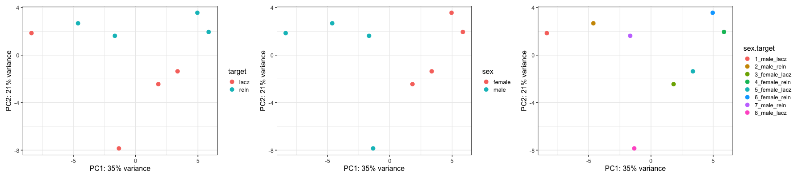
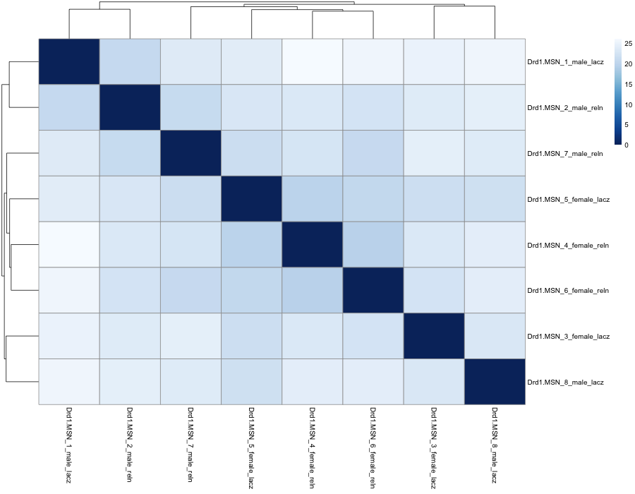
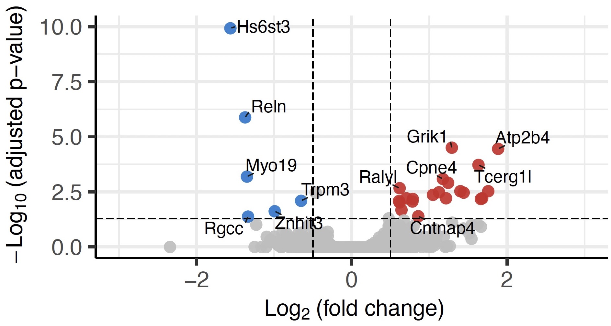

# Differential Gene Expression Analysis

This workflow is based off of work by Lara Ianov.

In this tutorial, we will run a differential gene expression analysis to identify differentially expressed genes (DEGs) between *RELN* knockdown samples and *lacZ* controls.

Load packages:

```
library(Seurat)
library(ggplot2)
library(Matrix.utils)
library(DESeq2)
library(dplyr)
library(RColorBrewer)
library(pheatmap)
library(EnhancedVolcano)
```

If any of the libraries are not already installed, see details below to install them.

<details><summary>Details: install packages</summary>

```
# For CRAN packages
install.packages("Seurat")
install.packages("ggplot2")
install.packages("dplyr")
install.packages("pheatmap")
install.packages("RColorBrewer")

# For Bioconductor packages
install.packages("BiocManager")
BiocManager::install("DESeq2")
BiocManager::install("EnhancedVolcano")

# For source code
# Matrix.utils was removed from CRAN
# Download source code for latest release here: https://cran.r-project.org/src/contrib/Archive/Matrix.utils/
# In RStudio: Tools > Install Packages > From package archive file
```

</details>


## 1. Metadata

First, we will load the integrated Seurat object, add a `sample.id` metadata column with a unique ID for each sample that corresponds to GEM_sex_target, and get a vector of sample names and cluster (cell type) names.

```
# Load integrated object
allRats <- readRDS("allRats_souped_noDoub.rds")

# Make sure cellType is correct after integrating & DoubletFinder
allRats$cellType <- Idents(allRats)

# Create a sample ID column: GEM_sex_stim
allRats$sample.id <- as.factor(paste(allRats$GEM, allRats$sex_target, sep = "_"))

# Named vector of sample names
sample_ids <- purrr::set_names(levels(allRats$sample.id))

# Get cell and sample metrics for aggregation
allRats@meta.data$cellType <- as.factor(allRats@meta.data$cellType)
cluster_names <- purrr::set_names(levels(allRats@meta.data$cellType))

# Number of clusters
cluster_total <- length(cluster_names)
# Total number of samples
sample_total <- length(sample_ids)
# Number of cells in each group
table(allRats$sample.id)
```

```
##   1_male_lacz   2_male_reln 3_female_lacz 4_female_reln
##           613           617           548           494
## 5_female_lacz 6_female_reln   7_male_reln   8_male_lacz
##           888          1391           577           866
```

## 2. Count aggregation to sample level
This is the **pseudobulked** part -- instead of gene counts per cell, we are aggregating the counts across all cells of a given cell type in a given sample.

```
# Make list of all cells: vars = cellType, sample.id
groups <- allRats@meta.data[, c("cellType", "sample.id")]

# Aggregate across cluster-sample groups using raw counts ("counts" slot)
count_aggr <- Matrix.utils::aggregate.Matrix(t(allRats@assays$RNA@counts),
                                             groupings = groups,
                                             fun = "sum")
```

We can take a peek at the output count_aggr matrix. In particular, pay attention to the rownames because that will make the next step make sense (note: only showing the first few columns here, not all 23,615 of them).

```
head(count_aggr)

## 6 x 23615 sparse Matrix of class "dgCMatrix"
##   [[ suppressing 61 column names ‘ENSRNOG00000066169’, ‘Irgq’, ‘Doc2g’ ... ]]
##
## Astrocyte_1_male_lacz   . 2  5 . . 1  4 . 3 4 .  5 4 . . 2 .  2 . . 1 1 . .
## Astrocyte_2_male_reln   . 5 14 . . 4 11 1 1 5 .  9 5 . . 3 . 15 . . 1 . . .
## Astrocyte_3_female_lacz . 2  4 . . 4  6 1 2 . . 10 6 . . 4 .  8 . 1 1 . . 3
## Astrocyte_4_female_reln . 2  . 1 . 2  6 . 8 2 .  6 3 . . 1 .  6 . . 1 . . .
## Astrocyte_5_female_lacz . 1  7 . . 2  6 1 4 1 .  9 6 3 . 1 . 13 . 1 1 1 . .
## Astrocyte_6_female_reln . 3  9 . 2 0 21 4 7 3 1 13 9 2 . 5 . 18 . 3 1 1 1 .
```

Now we need to create a separate counts matrix for each cell type and combine those matrices into a list named `raw_counts_list`. The original efficient code to do this fails with our data, probably because some samples don't have at least 1 cell from every cell type (samples S3 and S4 don't have Drd3-MSN, and sample S5 doesn't have Pvalb-Int). The extremely bulky code below is a workaround. It's ugly, but it works.

```
# Make lists of rows to keep for subsets
# Note that the names here exactly match rownames in count_aggr (see above)
keep_rows_astro <- c("Astrocyte_1_male_lacz", "Astrocyte_2_male_reln", "Astrocyte_3_female_lacz", "Astrocyte_4_female_reln", "Astrocyte_5_female_lacz", "Astrocyte_6_female_reln", "Astrocyte_7_male_reln", "Astrocyte_8_male_lacz")
keep_rows_Drd1 <- c("Drd1-MSN_1_male_lacz", "Drd1-MSN_2_male_reln", "Drd1-MSN_3_female_lacz", "Drd1-MSN_4_female_reln", "Drd1-MSN_5_female_lacz", "Drd1-MSN_6_female_reln", "Drd1-MSN_7_male_reln", "Drd1-MSN_8_male_lacz")
keep_rows_Drd2.1 <- c("Drd2-MSN-1_1_male_lacz", "Drd2-MSN-1_2_male_reln", "Drd2-MSN-1_3_female_lacz", "Drd2-MSN-1_4_female_reln", "Drd2-MSN-1_5_female_lacz", "Drd2-MSN-1_6_female_reln", "Drd2-MSN-1_7_male_reln", "Drd2-MSN-1_8_male_lacz")
keep_rows_Drd2.2 <- c("Drd2-MSN-2_1_male_lacz", "Drd2-MSN-2_2_male_reln", "Drd2-MSN-2_3_female_lacz", "Drd2-MSN-2_4_female_reln", "Drd2-MSN-2_5_female_lacz", "Drd2-MSN-2_6_female_reln", "Drd2-MSN-2_7_male_reln", "Drd2-MSN-2_8_male_lacz")
keep_rows_Drd3 <- c("Drd3-MSN_1_male_lacz", "Drd3-MSN_2_male_reln", "Drd3-MSN_3_female_lacz", "Drd3-MSN_4_female_reln", "Drd3-MSN_5_female_lacz", "Drd3-MSN_6_female_reln", "Drd3-MSN_7_male_reln", "Drd3-MSN_8_male_lacz")
keep_rows_grm8 <- c("Grm8-MSN_1_male_lacz", "Grm8-MSN_2_male_reln", "Grm8-MSN_3_female_lacz", "Grm8-MSN_4_female_reln", "Grm8-MSN_5_female_lacz", "Grm8-MSN_6_female_reln", "Grm8-MSN_7_male_reln", "Grm8-MSN_8_male_lacz")
keep_rows_gaba <- c("GABA-Undef_1_male_lacz", "GABA-Undef_2_male_reln", "GABA-Undef_3_female_lacz", "GABA-Undef_4_female_reln", "GABA-Undef_5_female_lacz", "GABA-Undef_6_female_reln", "GABA-Undef_7_male_reln", "GABA-Undef_8_male_lacz")
keep_rows_pvalb <- c("Pvalb-Int_1_male_lacz", "Pvalb-Int_2_male_reln", "Pvalb-Int_3_female_lacz", "Pvalb-Int_4_female_reln", "Pvalb-Int_5_female_lacz", "Pvalb-Int_6_female_reln", "Pvalb-Int_7_male_reln", "Pvalb-Int_8_male_lacz")
keep_rows_sst <- c("Sst-Int_1_male_lacz", "Sst-Int_2_male_reln", "Sst-Int_3_female_lacz", "Sst-Int_4_female_reln", "Sst-Int_5_female_lacz", "Sst-Int_6_female_reln", "Sst-Int_7_male_reln", "Sst-Int_8_male_lacz")
keep_rows_micro <- c("Microglia_1_male_lacz", "Microglia_2_male_reln", "Microglia_3_female_lacz", "Microglia_4_female_reln", "Microglia_5_female_lacz", "Microglia_6_female_reln", "Microglia_7_male_reln", "Microglia_8_male_lacz")
keep_rows_mural <- c("Mural_1_male_lacz", "Mural_2_male_reln", "Mural_3_female_lacz", "Mural_4_female_reln", "Mural_5_female_lacz", "Mural_6_female_reln", "Mural_7_male_reln", "Mural_8_male_lacz")
keep_rows_olig <- c("Olig_1_male_lacz", "Olig_2_male_reln", "Olig_3_female_lacz", "Olig_4_female_reln", "Olig_5_female_lacz", "Olig_6_female_reln", "Olig_7_male_reln", "Olig_8_male_lacz")
keep_rows_poly <- c("Polydend_1_male_lacz", "Polydend_2_male_reln", "Polydend_3_female_lacz", "Polydend_4_female_reln", "Polydend_5_female_lacz", "Polydend_6_female_reln", "Polydend_7_male_reln", "Polydend_8_male_lacz")

# Create subsets
subset_astro <- t(count_aggr[rownames(count_aggr) %in% keep_rows_astro, ])
subset_Drd1 <- t(count_aggr[rownames(count_aggr) %in% keep_rows_Drd1, ])
subset_Drd2.1 <- t(count_aggr[rownames(count_aggr) %in% keep_rows_Drd2.1, ])
subset_Drd2.2 <- t(count_aggr[rownames(count_aggr) %in% keep_rows_Drd2.2, ])
subset_Drd3 <- t(count_aggr[rownames(count_aggr) %in% keep_rows_Drd3, ])
subset_grm8 <- t(count_aggr[rownames(count_aggr) %in% keep_rows_grm8, ])
subset_gaba <- t(count_aggr[rownames(count_aggr) %in% keep_rows_gaba, ])
subset_pvalb <- t(count_aggr[rownames(count_aggr) %in% keep_rows_pvalb, ])
subset_sst <- t(count_aggr[rownames(count_aggr) %in% keep_rows_sst, ])
subset_micro <- t(count_aggr[rownames(count_aggr) %in% keep_rows_micro, ])
subset_mural <- t(count_aggr[rownames(count_aggr) %in% keep_rows_mural, ])
subset_olig <- t(count_aggr[rownames(count_aggr) %in% keep_rows_olig, ])
subset_poly <- t(count_aggr[rownames(count_aggr) %in% keep_rows_poly, ])

# Combine subsets into a list
raw_counts_list <- list(subset_astro, subset_Drd1, subset_Drd2.1, subset_Drd2.2,
                        subset_Drd3, subset_grm8, subset_gaba, subset_pvalb,
                        subset_sst, subset_micro, subset_mural, subset_olig,
                        subset_poly)

# Add sublist names
names(raw_counts_list) <- c("Astrocyte", "Drd1.MSN", "Drd2.MSN.1", "Drd2.MSN.2",
                            "Drd3.MSN", "Grm8.MSN", "GABA.Undef", "Pvalb.Int",
                            "Sst.Int", "Microglia", "Mural", "Olig", "Polydend")

# Replace - with . in cluster names only
# Omit any missing datasets! (here, 3 & 4 for Drd3-MSN; 5 for Pvalb-Int)
colnames(raw_counts_list[[2]]) <- c("Drd1.MSN_1_male_lacz","Drd1.MSN_2_male_reln","Drd1.MSN_3_female_lacz","Drd1.MSN_4_female_reln","Drd1.MSN_5_female_lacz","Drd1.MSN_6_female_reln","Drd1.MSN_7_male_reln","Drd1.MSN_8_male_lacz")
colnames(raw_counts_list[[3]]) <- c("Drd2.MSN.1_1_male_lacz","Drd2.MSN.1_2_male_reln","Drd2.MSN.1_3_female_lacz","Drd2.MSN.1_4_female_reln","Drd2.MSN.1_5_female_lacz","Drd2.MSN.1_6_female_reln","Drd2.MSN.1_7_male_reln","Drd2.MSN.1_8_male_lacz")
colnames(raw_counts_list[[4]]) <- c("Drd2.MSN.2_1_male_lacz","Drd2.MSN.2_2_male_reln","Drd2.MSN.2_3_female_lacz","Drd2.MSN.2_4_female_reln","Drd2.MSN.2_5_female_lacz","Drd2.MSN.2_6_female_reln","Drd2.MSN.2_7_male_reln","Drd2.MSN.2_8_male_lacz")
colnames(raw_counts_list[[5]]) <- c("Drd3.MSN_1_male_lacz","Drd3.MSN_2_male_reln","Drd3.MSN_5_female_lacz","Drd3.MSN_6_female_reln","Drd3.MSN_7_male_reln","Drd3.MSN_8_male_lacz")
colnames(raw_counts_list[[6]]) <- c("Grm8.MSN_1_male_lacz","Grm8.MSN_2_male_reln","Grm8.MSN_3_female_lacz","Grm8.MSN_4_female_reln","Grm8.MSN_5_female_lacz","Grm8.MSN_6_female_reln","Grm8.MSN_7_male_reln","Grm8.MSN_8_male_lacz")
colnames(raw_counts_list[[7]]) <- c("GABA.Undef_1_male_lacz","GABA.Undef_2_male_reln","GABA.Undef_3_female_lacz","GABA.Undef_4_female_reln","GABA.Undef_5_female_lacz","GABA.Undef_6_female_reln","GABA.Undef_7_male_reln","GABA.Undef_8_male_lacz")
colnames(raw_counts_list[[8]]) <- c("Pvalb.Int_1_male_lacz","Pvalb.Int_2_male_reln","Pvalb.Int_3_female_lacz","Pvalb.Int_4_female_reln","Pvalb.Int_6_female_reln","Pvalb.Int_7_male_reln","Pvalb.Int_8_male_lacz")
colnames(raw_counts_list[[9]]) <- c("Sst.Int_1_male_lacz","Sst.Int_2_male_reln","Sst.Int_3_female_lacz","Sst.Int_4_female_reln","Sst.Int_5_female_lacz","Sst.Int_6_female_reln","Sst.Int_7_male_reln","Sst.Int_8_male_lacz")

# Remove objects no longer needed
rm(list=ls(pattern="subset_"))
rm(list=ls(pattern="keep_rows_"))
```

## 3. More metadata (sample-level)

Create a vector (`de_samples`) of all sample names. Here, "sample" means unique GEM and cell type, so we have a total of 101 samples. (It would be 13 cell types x 8 GEM wells = 104 samples, but for the missing cell types in a couple of GEMs.)

```
get_sample_ids <- function(x){
  raw_counts_list[[x]] %>%
    colnames()
}

de_samples <- purrr::map(1:length(cluster_names), get_sample_ids) %>%
  unlist()
```

Now we use `de_samples` to create a metadata dataframe with cluster ID (cell type), sample ID (celltype_GEM_sex_target), sex.target (really GEM_sex_target), and individual columns GEM, sex, and target. "Target" here refers to treatment condition: Reln or lacZ.

```
# Create metadata dataframe with sample IDs, cluster IDs, and condition
metadata <- data.frame(cluster_id = sub("_.*","", de_samples),
                       sample_id  = de_samples,
                       sex.target = sub("^[^_]*_","", de_samples))

# Create extra columns in metadata
metadata$GEM    <- as.factor(as.character(lapply(strsplit(metadata$sex.target,"_"),"[",1)))
metadata$sex    <- as.factor(as.character(lapply(strsplit(metadata$sex.target,"_"),"[",2)))
metadata$target <- as.factor(as.character(lapply(strsplit(metadata$sex.target,"_"),"[",3)))
```

## 4. Create a DESEqDataSet from object

Now we're ready to run the DEG analysis. We will identify Reln DEGs (genes differentially expressed in Reln knockdowns relative to lacZ controls) **for each cell type**.

The first step is to create a DESeq2 dataset for each cell type. That is accomplished with the loop shown below using `mapply()` to apply the function iteratively to each cell type.

Within the loop are four main steps:
1. Subset the metadata for that cell type and assign row names
2. Subset the counts matrix for that cell type
3. Create the DESeq2 object named dds
4. Set the reference to the control condition, lacZ

The `mapply()` function combines all the resulting dds objects into a large list named `dds_all_cells`.

Step 3 is done with this code:

```
dds <- DESeqDataSetFromMatrix(cluster_counts,
                              colData = cluster_metadata,
                              design = ~ sex + target)
```

The `DESeqDataSetFromMatrix()` function pulls counts and metadata and sets the analysis design. The design `~ sex + target` means we are testing the effect of target (treatment condition) on gene expression, controlling for sex. (This will make more sense later when we show the likelihood-ratio test and the reduced model as only `~ sex`, with target removed from the model.)

Here is the full loop for creating the list of dds objects:

```
dds_all_cells <- mapply(FUN = function(x, y, z) {

  # Subset metadata by cell type being tested
  cluster_metadata <- subset(metadata, cluster_id == z)

  # Assign rownames of metadata to be sample IDs
  rownames(cluster_metadata) <- cluster_metadata$sample_id
  print(head(cluster_metadata))

  # Subset raw counts to cell type being tested
  counts <- raw_counts_list[[y]]
  cluster_counts <- data.frame(counts[, which(colnames(counts) %in% rownames(cluster_metadata))])
  print(head(cluster_counts))

  # Check that all row names of metadata are the same and in the same order as cols of counts
  stopifnot(all(rownames(cluster_metadata) == colnames(cluster_counts)))

  dds <- DESeqDataSetFromMatrix(cluster_counts,
                                colData = cluster_metadata,
                                design = ~ sex + target)

  # Set reference to lacz
  dds$target <- relevel(dds$target, ref = "lacz")
  return(dds)

}, x = raw_counts_list, y = 1:length(raw_counts_list), z = names(raw_counts_list))
```

Here's a look at the output for just one cluster (Drd1.MSN):

```
print(head(cluster_metadata))

##                        cluster_id              sample_id    sex.target GEM    sex target
## Drd1.MSN_1_male_lacz     Drd1.MSN   Drd1.MSN_1_male_lacz   1_male_lacz   1   male   lacz
## Drd1.MSN_2_male_reln     Drd1.MSN   Drd1.MSN_2_male_reln   2_male_reln   2   male   reln
## Drd1.MSN_3_female_lacz   Drd1.MSN Drd1.MSN_3_female_lacz 3_female_lacz   3 female   lacz
## Drd1.MSN_4_female_reln   Drd1.MSN Drd1.MSN_4_female_reln 4_female_reln   4 female   reln
## Drd1.MSN_5_female_lacz   Drd1.MSN Drd1.MSN_5_female_lacz 5_female_lacz   5 female   lacz
## Drd1.MSN_6_female_reln   Drd1.MSN Drd1.MSN_6_female_reln 6_female_reln   6 female   reln
```

```
print(head(cluster_counts))

##                    Drd1.MSN_1_male_lacz Drd1.MSN_2_male_reln Drd1.MSN_3_female_lacz Drd1.MSN_4_female_reln Drd1.MSN_5_female_lacz Drd1.MSN_6_female_reln Drd1.MSN_7_male_reln Drd1.MSN_8_male_lacz
## ENSRNOG00000066169                    1                    0                      0                      0                      0                      0                    0                    0
## Irgq                                  3                    7                      3                      6                     13                     12                   12                    5
## Doc2g                                10                    1                      9                      8                      2                     14                   10                    4
## Ceacam16                              1                    0                      0                      0                      1                      0                    0                    0
## ENSRNOG00000064851                    0                    0                      0                      0                      0                      0                    0                    0
## AC118165.1                           24                   11                      9                     19                     12                     18                   13                   22
```

## 5. Remove genes with mean counts < 5

This is a QC step to remove genes with either mean or minimum count less than 5 (here we use mean).

```
dds_all_cells <- mapply(FUN = function(x, z) {

  #----- Counts Pre-filtering based on rowMeans -------
  # Here rowMeans is used, but can also use rowSums or min. per sample
  message(paste0("Number of genes before pre-filtering ", z, ": ",  nrow(counts(x))))
  keep <- rowMeans(counts(x)) > 5
  x <- x[keep,]
  message(paste0("Number of genes after pre-filtering ", z, ": ",  nrow(counts(x))))
  return(x)
}, x = dds_all_cells, z = gsub("-", ".", names(dds_all_cells)))
```

<details><summary>Output</summary>

```
## Number of genes before pre-filtering Astrocyte: 23615
## Number of genes after pre-filtering Astrocyte: 8847
## Number of genes before pre-filtering Drd1.MSN: 23615
## Number of genes after pre-filtering Drd1.MSN: 12112
## Number of genes before pre-filtering Drd2.MSN.1: 23615
## Number of genes after pre-filtering Drd2.MSN.1: 11064
## Number of genes before pre-filtering Drd2.MSN.2: 23615
## Number of genes after pre-filtering Drd2.MSN.2: 4902
## Number of genes before pre-filtering Drd3.MSN: 23615
## Number of genes after pre-filtering Drd3.MSN: 2035
## Number of genes before pre-filtering Grm8.MSN: 23615
## Number of genes after pre-filtering Grm8.MSN: 8960
## Number of genes before pre-filtering GABA.Undef: 23615
## Number of genes after pre-filtering GABA.Undef: 10476
## Number of genes before pre-filtering Pvalb.Int: 23615
## Number of genes after pre-filtering Pvalb.Int: 3310
## Number of genes before pre-filtering Sst.Int: 23615
## Number of genes after pre-filtering Sst.Int: 1589
## Number of genes before pre-filtering Microglia: 23615
## Number of genes after pre-filtering Microglia: 4497
## Number of genes before pre-filtering Mural: 23615
## Number of genes after pre-filtering Mural: 273
## Number of genes before pre-filtering Olig: 23615
## Number of genes after pre-filtering Olig: 6378
## Number of genes before pre-filtering Polydend: 23615
## Number of genes after pre-filtering Polydend: 3969
```

</details>

## 6. Quality control: visualization

Before doing the actual DEG analysis, we will make some plots to check data quality and determine if we need to remove any outlier samples (not shown here). See more details in the [DESeq2 documentation](https://bioconductor.org/packages/devel/bioc/vignettes/DESeq2/inst/doc/DESeq2.html#data-quality-assessment-by-sample-clustering-and-visualization).

Let's generate PCA plots (useful for visualizing the overall effect of treatment) and heatmaps of sample-sample similarity.

Differential expression testing is done on the raw counts matrix, but visualization is usually better with transformed data, such as *variance stabilizing transformation (VST)*, which is used here. Setting `blind = FALSE` means the transformation is *not* blind to treatment and considers differences in gene expression by treatment instead of discounting it as noise.

In the full R code, the following two blocks are combined into a single loop; here, I've split them up for clarity so we can look separately at PCA and heatmap.

Make output folder: `dir.create("DESeq2_QC")`

1. **PCA plots**

```
# Custom function to save PCA plots
plot_output <- function(p, file_name, w_png = 700,
                                      h_png = 600,
                                      w_pdf = 12,
                                      h_pdf = 8,
                                      show_plot = TRUE){

  png(paste0(file_name,".png"), width = w_png, height = h_png)
  plot(eval(p))
  dev.off()

  pdf(paste0(file_name,".pdf"), width = w_pdf, height = h_pdf)
  plot(eval(p))
  dev.off()

  if (show_plot) {
    plot(eval(plot))
  }
}

# Make plots for each cell type
mapply(FUN = function(x, z) {
  vsd <- varianceStabilizingTransformation(x, blind = FALSE)

  # PCA
  #-----------------Target-------------------
  data <- plotPCA(vsd, intgroup = c("target"), returnData = TRUE)
  percentVar <- round(100 * attr(data, "percentVar"))

  pca.plot.target <- ggplot(data, aes(PC1, PC2, color = target)) +
    geom_point(size = 4) +
    xlab(paste0("PC1: ", percentVar[1], "% variance")) +
    ylab(paste0("PC2: ", percentVar[2], "% variance")) +
    theme(text = element_text(size = 20)) +
    theme_bw(base_size = 16)

  #-----------------Sex---------------------
  data <- plotPCA(vsd, intgroup = c("sex"), returnData = TRUE)

  pca.plot.sex <- ggplot(data, aes(PC1, PC2, color = sex)) +
    geom_point(size = 4) +
    xlab(paste0("PC1: ", percentVar[1], "% variance")) +
    ylab(paste0("PC2: ", percentVar[2], "% variance")) +
    theme(text = element_text(size = 20)) +
    theme_bw(base_size = 16)

  #-----------------Sex.Target------------------
  data <- plotPCA(vsd, intgroup = c("sex.target"), returnData = TRUE)

  pca.plot.sex.target <- ggplot(data, aes(PC1, PC2, color = sex.target)) +
    geom_point(size = 4) +
    xlab(paste0("PC1: ", percentVar[1], "% variance")) +
    ylab(paste0("PC2: ", percentVar[2], "% variance")) +
    theme(text = element_text(size = 20)) +
    theme_bw(base_size = 16)

  all_pca <- pca.plot.target + pca.plot.sex + pca.plot.sex.target
  file_name_pca <- paste0("DESeq2_QC/PCA_", z)
  plot_output(all_pca, file_name = file_name_pca,
              w_png = 1800, w_pdf = 20, h_png = 400, h_pdf = 6, show_plot = FALSE)

}, x = dds_all_cells, z = gsub("-", ".", names(dds_all_cells)))
```



2. **Heatmaps**

```
# Custom function to save heatmaps
pheatmap_output <- function(x, file_name, w_png = 900,
                                          h_png = 700,
                                          w_pdf = 12,
                                          h_pdf = 8) {

  png(paste0(file_name,".png"), width = w_png, height = h_png)

  grid::grid.newpage()
  grid::grid.draw(x$gtable)
  dev.off()

  pdf(paste0(file_name,".pdf"), width = w_pdf, height = h_pdf)

  grid::grid.newpage()
  grid::grid.draw(x$gtable)
  dev.off()
}

# Make plots for each cell type
mapply(FUN = function(x, z) {
  vsd <- varianceStabilizingTransformation(x, blind = FALSE)

  # Sample-to-samples distances heatmap:
  # Dist computes distance with Euclidean method
  sampleDists <- dist(t(assay(vsd)))
  sampleDistMatrix <- as.matrix(sampleDists)
  colors <- colorRampPalette(rev(brewer.pal(9, "Blues")))(255)

  heatmap_dist <- pheatmap(sampleDistMatrix,
                           clustering_distance_rows = sampleDists,
                           clustering_distance_cols = sampleDists,
                           col = colors
  )

  file_name_heatmap <- paste0("DESeq2_QC/sample_to_sample_heatmap_", z)
  # save output
  pheatmap_output(heatmap_dist, file_name = file_name_heatmap)

}, x = dds_all_cells, z = gsub("-", ".", names(dds_all_cells)))
```



## 7. Differential expression testing

### 7.1. Run the analysis

This is the step where we actually run the DEG analysis with the function `DESeq()`. For each cell type, we run the analysis with this line of code from the block below:

```
x <- DESeq(x, test = "LRT", reduced = ~ sex)
```

Notice that here is where we specify the type of test as a **likelihood-ratio test** ("LRT"). The **full model** is the one we specified previously in step 4.3 (`~ sex + target`), and the **reduced model** is specified here as `~ sex`. So the LRT tests whether the model that includes both sex & target is a statistically significantly better fit than the model that includes only sex. If yes, that gene is considered to be differentially expressed between Reln and lacZ.

In the results, the **adjusted *p*-value** tells us whether or not the difference in gene expression is significant, and the **log2-fold change** tells us the magnitude of the difference in expression. Because we set the reference treatment to lacZ, all fold-change directions (positive, negative) will be relative to the lacZ condition (i.e., positive change = upregulated in Reln KD condition; negative change = downregulated in Reln KD condition).

The function to run differential expression testing is simple: `DESeq()`. We will also create a dispersion plot; more info in the [DESeq2 documentation](https://bioconductor.org/packages/devel/bioc/vignettes/DESeq2/inst/doc/DESeq2.html#dispersion-plot-and-fitting-alternatives).

```
# Make output folder
dir.create("DESeq2_DEGResults")

dds_all_cells <- mapply(FUN = function(x, z) {
  x <- DESeq(x, test = "LRT", reduced = ~ sex)

  # Checking coeff by resultsNames(dds):
  resultsNames(x)

  # Dispersion plot
  file_name_dist <- paste0("DESeq2_DEGResults/DispPlot_", z, ".pdf")
  pdf(file_name_dist)
  plotDispEsts(x)
  dev.off()
  return(x)
}, x = dds_all_cells, z = gsub("-", ".", names(dds_all_cells)))
```

```
## using pre-existing normalization factors
## estimating dispersions
## found already estimated dispersions, replacing these
## gene-wise dispersion estimates
## mean-dispersion relationship
## final dispersion estimates
## fitting model and testing
```

### 7.2. Calculate results

Calculate the results here. This is where the reference we set earlier comes in; the `results()` function incorporates the reference in determining the fold-change direction.

```
res_all_cells <- mapply(FUN = function(x) {
  res <- results(x) # ref level established earlier by relevel
  return(res)
}, x = dds_all_cells)
```

The output, `res_all_cells`, is a list of `res` results objects, one for each cell type. Here is an example for Drd1.MSN:

```
## $Drd1.MSN
## log2 fold change (MLE): target reln vs lacz
## LRT p-value: '~ sex + target' vs '~ sex'
## DataFrame with 12112 rows and 6 columns
##                     baseMean log2FoldChange     lfcSE        stat    pvalue      padj
##                    <numeric>      <numeric> <numeric>   <numeric> <numeric> <numeric>
## Irgq                 7.19616      0.5750111  0.617911 0.856205385  0.354803        NA
## Doc2g                7.20061      0.0115173  0.687189 0.000275866  0.986748        NA
## AC118165.1          15.55095     -0.1874437  0.418539 0.195963765  0.657999  0.999315
## Got1               144.55032     -0.1649557  0.173965 0.895512356  0.343988  0.999315
## Map6               115.03915      0.0398396  0.186513 0.045664675  0.830787  0.999315
## ...                      ...            ...       ...         ...       ...       ...
## ENSRNOG00000066356   5.79603       1.022153  0.711615   2.1062980  0.146694        NA
## ENSRNOG00000065062  21.81433       0.309909  0.404281   0.5619016  0.453495  0.999315
## ENSRNOG00000062442   6.03848       0.470196  0.716781   0.4215699  0.516155        NA
## ENSRNOG00000070895   5.94834       0.310198  0.695804   0.2011721  0.653776        NA
```

You'll notice that some of the adjusted p-values show `NA`... we can ignore that. Sometimes DESeq2 will output NA values for genes with low mean normalized counts.

### 7.3. Calculate percent cells expressing gene

This section creates a column in the results matrix containing the percent of cells expressing each gene. Note that this doesn't say anything about the *level of expression*, only how many cells express the gene *at all*.

Because we're going to be pulling counts data now from the original integrated object (`allRats`), we need to change the Idents (cluster names) to match the names we've been using here -- i.e., replacing dash with period. Then we pull normalized counts from the `allRats` object, data slot, and store them in a dgCMatrix object named `seuratCounts`.

```
Idents(allRats) <- gsub(Idents(allRats), pattern = "-", replacement = ".")

seuratCounts <- t(GetAssayData(object = allRats, slot = "data", assay = "RNA"))
```

Now to calculate percent of cells expressing each gene and add that info to the results:

```
for(i in names(res_all_cells)){

  print(paste("Beginning:", nrow(res_all_cells[[i]])))
  res_all_cells[[i]] <- as.data.frame(res_all_cells[[i]])

  # Create a gene name column
  res_all_cells[[i]]$gene <- row.names(res_all_cells[[i]])

  # Pull genes and calculate percent expressing
  genesPctExp <- as.data.frame(colMeans(seuratCounts[WhichCells(object = allRats, idents = i), res_all_cells[[i]]$gene]>0)*100)

  # Change column names
  genesPctExp$gene <- row.names(genesPctExp)
  colnames(genesPctExp)[1] <- "Pct_Expressing"

  # Add percent expressing to dataframe
  res_all_cells[[i]] <- merge(x = res_all_cells[[i]],
                              y = genesPctExp,
                              by = "gene")

  print(paste("End:", nrow(res_all_cells[[i]])))
}
```

## 8. Write output to files

For each cell type, write a CSV file of all DEGs:

```
# Make output folder
dir.create("DESeq2_Reln_Collapsed")

# Write out the files
mapply(FUN = function(x, z) {
  file_name <- paste0("DESeq2_Reln_Collapsed/DESeq2_res_", z, ".csv")
  write.csv(x, file=file_name, row.names = TRUE, quote = FALSE)
}, x = res_all_cells, z = gsub("-", ".", names(res_all_cells)))
```

For each cell type, write a CSV file of the normalized counts for all genes for each sample:

```
# Save counts
mapply(FUN = function(x, z) {
  file_name_norm <- paste0("DESeq2_Reln_Collapsed/normalized_counts_", z, ".csv")
  normalized_counts <- as.data.frame(counts(x, normalized = TRUE))
  write.csv(normalized_counts, file = file_name_norm, row.names = TRUE, quote = FALSE)
}, x = dds_all_cells, z = gsub("-", ".", names(dds_all_cells)))
```

Lastly, make a single table that lists the number of significant DEGs (adjusted p-value <= 0.05) for each cell type.

NOTE: Change `nrow` to your correct number of names in `dds_all_cells` (i.e., number of clusters)

```
DEGs_DF <- as.data.frame(matrix(ncol = 2, nrow = 13))
colnames(DEGs_DF) <- c("cellType", "number_of_DEGs")
rownames(DEGs_DF) <- names(dds_all_cells)
DEGs_DF$cellType  <- names(dds_all_cells)

for(i in names(dds_all_cells)){
  x <- as.data.frame(res_all_cells[[i]])
  DEGs_DF[i,"number_of_DEGs"] <- nrow(subset(x, subset = (padj <= 0.05)))
}

write.table(x         = DEGs_DF,
            file      = "DESeq2_Reln_Collapsed/number_of_DEGs_Per_cellType.txt",
            sep       = "\t",
            col.names = TRUE,
            row.names = FALSE,
            quote     = FALSE)
```

## 9. Visualize DEGs

A common way to visualize DEGs is with a **volcano plot**. There are several ways to make a volcano plot, but the package `EnhancedVolcano` was written specifically for volcano plots and is fairly customizable. One useful thing this package does that a standard ggplot does not do is [automatically handle adjusted p-values of 0](https://github.com/kevinblighe/EnhancedVolcano/blob/master/R/EnhancedVolcano.R#L314), which otherwise could not be plotted on a -Log(10) scale.

To customize the plot so that it shows upregulated and downregulated significant DEGs in different colors, we first need to set a variable containing `ifelse` arguments. *Change the threshold levels and colors as desired.*

Using Drd1.MSN as an example:

```
keyvals <- ifelse(
  res_all_cells[["Drd1.MSN"]]$log2FoldChange < (-0.5) & res_all_cells[["Drd1.MSN"]]$padj < 0.05, "dodgerblue3",
    ifelse(res_all_cells[["Drd1.MSN"]]$log2FoldChange > (0.5) & res_all_cells[["Drd1.MSN"]]$padj < 0.05, "firebrick3",
           "grey"))

# Name the color levels (plot often fails without this step)
names(keyvals)[keyvals == "dodgerblue3"] <- "downregulated"
names(keyvals)[keyvals == "firebrick3"] <- "upregulated"
names(keyvals)[keyvals == "grey"] <- "NS"
```

Now create the volcano plot, using the `keyvals` variable to set the colors. I also included some other customized options here that work well with this dataset but may need to be changed for your data (or preferences). There are also other options you can toy with, found in the [R code here](https://github.com/kevinblighe/EnhancedVolcano/blob/master/R/EnhancedVolcano.R) or [vignette here](https://bioconductor.org/packages/devel/bioc/vignettes/EnhancedVolcano/inst/doc/EnhancedVolcano.html).

By default, EnhancedVolcano attempts to label as many significant DEGs as will fit on the plot without too much overlap. But you might want to only label select DEGs. As an example, below I have `selectLab` set to label 4 genes of interest: Hs6st3, Reln, Atp2b4, and Grik1. It's currently commented out (with `#`), but you can un-comment that option (remove `#`) and change the gene names if you want to.

```
volcano <- EnhancedVolcano(res_all_cells[["Drd1.MSN"]],
                           x = "log2FoldChange", y = "padj",
                           lab = res_all_cells[["Drd1.MSN"]]$gene,
                          #selectLab = c("Hs6st3", "Reln", "Atp2b4", "Grik1"),
                           pCutoff = 0.05,
                           FCcutoff = 0.5,
                           pointSize = 4.0,
                           colAlpha = 0.9,
                           colCustom = keyvals,
                           drawConnectors = TRUE,
                           arrowheads = FALSE,
                           xlim = c(-5, 5),
                           ylim = c(0, 10),
                           xlab = bquote(~Log[2]~ "(fold change)"),
                           ylab = bquote(~-Log[10] ~ "(adjusted p-value)"),
                           title = "", subtitle = "",
                           legendPosition = "none",
                           caption = "")
```


